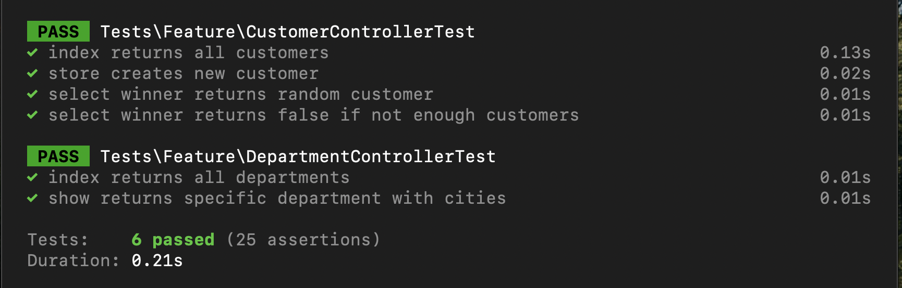
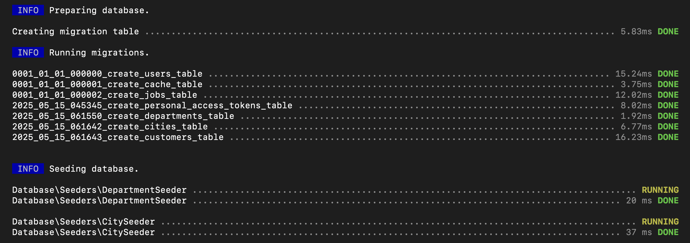
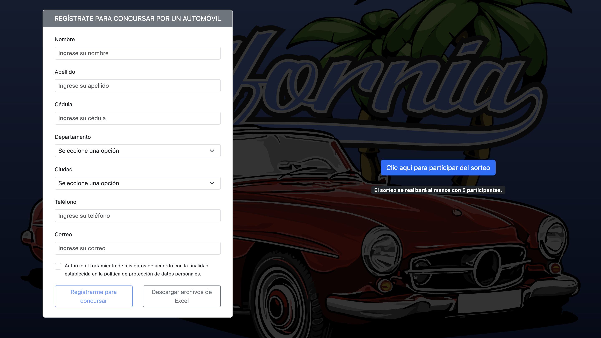
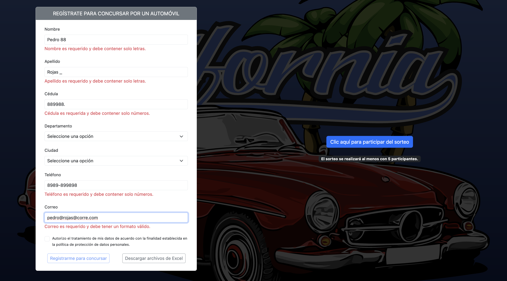
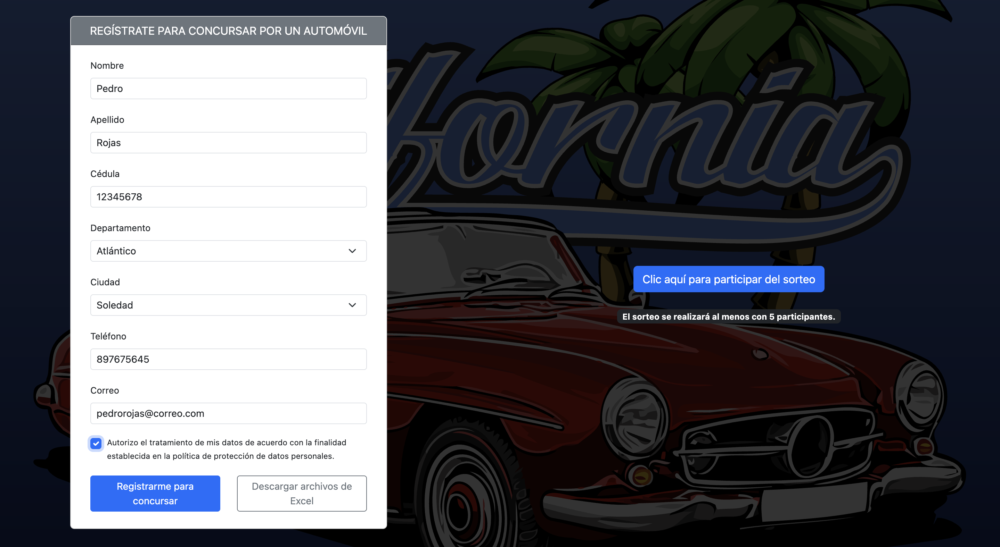
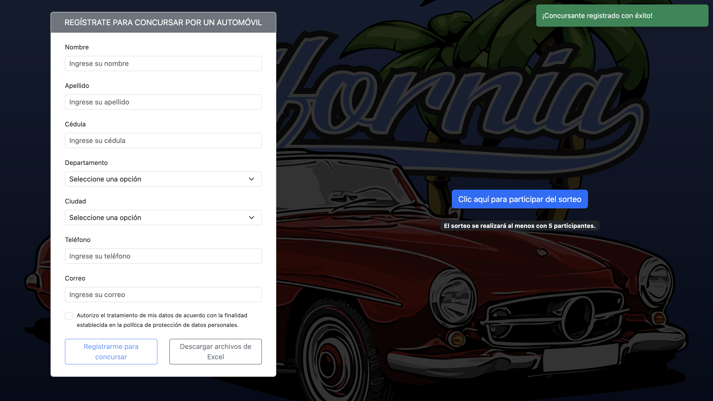
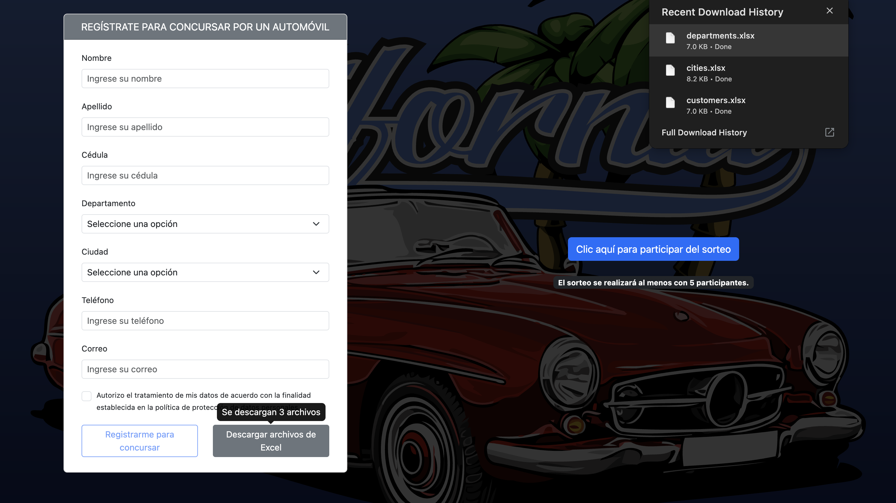

# Proyecto Fullstack: Angular y Laravel

Este proyecto es una aplicación fullstack que combina un frontend desarrollado en Angular y un backend construido con Laravel. Está diseñado para ser modular, escalable y fácil de mantener, siguiendo las mejores prácticas tanto en el desarrollo frontend como backend.

## Diagrama de la base de datos (se exclueron del gráfico las tablas que se instalan por defecto)


## Pruebas unitarias realizadas al backend



## Ejecución de las migraciones y seeders



## Vista y funcionamiento de la aplicación









## Contenido del Proyecto

### Frontend (Angular)
- **Framework**: Angular 19+
- **Estructura**:
  - `src/app/models/`: Modelos de datos utilizados en la aplicación.
  - `src/app/interfaces/`: Interfaces para tipado fuerte en TypeScript.
  - `src/app/services/`: Servicios para la comunicación con el backend.
  - `src/app/pages/`: Componentes específicos de cada página.
  - `src/app/shared/`: Componentes reutilizables.
  - `src/environments/`: Configuración de entornos (desarrollo y producción).

### Backend (Laravel)
- **Framework**: Laravel 12+
- **Estructura**:
  - `app/Exports/`: Clases para exportar datos en formatos como Excel.
  - `app/Http/Controllers/`: Controladores para manejar las solicitudes HTTP.
  - `app/Models/`: Modelos Eloquent para interactuar con la base de datos.
  - `database/migrations/`: Migraciones para la estructura de la base de datos.
  - `database/seeders/`: Seeders para poblar datos iniciales.

## Cómo replicar el proyecto en un ambiente local

### Requisitos previos
- Docker

### Pasos

1. ** Abrir docker y dejarlo correr si se quiere en segundo plano **

2. **Clonar el repositorio o descargar de él, únicamente el archivo /docker-compose-laravel-angular/docker-compose.yaml**:

3. **Ejecutar uno de los siguientes comandos de docker-compose según el escenario**

- Si en la terminal, el prompt se encuentra en la carpeta que contiene el archivo docker-compose.yaml:

```bash
docker compose up -d
```

- Si en la terminal, el prompt se encuentra fuera de la carpeta que contiene el archivo docker-compose.yaml:

```bash
docker compose -f /docker-compose-laravel-angular/docker-compose.yaml up -d
```
**Nota:** La ruta tendrá que cambiarse según la ubicación del archivo `docker-compose.yaml` en su máquina.

4. Eso es todo, ahora mediante un navegador ingrese al frontend mediante la URL localhost:4200, o al backend mediante la URL localhost:8000 para hacer validaciones directas a la API.

## Buenas prácticas implementadas

### Backend (Laravel)
- **Estructura modular**: Uso de controladores, modelos y servicios para separar responsabilidades.
- **Exportación de datos**: Clases en `app/Exports/` para exportar datos en Excel.
- **Migraciones y seeders**: Migraciones para la estructura de la base de datos y seeders para datos iniciales.
- **Validación de datos**: Uso de `FormRequest` para validar las solicitudes.
- **Pruebas unitarias**: Implementación de pruebas unitarias para garantizar la calidad del código.
- **Middleware personalizado**: Uso de middleware como `ForceJsonResponse` para estandarizar las respuestas de la API.

### Frontend (Angular)
- **Componentes standalone**: Uso de componentes independientes para modularidad.
- **Servicios centralizados**: Servicios en `src/app/services/` para manejar la lógica de negocio y las llamadas HTTP.
- **Modelos e interfaces**: Uso de `src/app/models/` y `src/app/interfaces/` para tipado fuerte y consistencia.
- **Environments**: Configuración separada para desarrollo y producción en `src/environments/`.
- **Validación reactiva**: Uso de formularios reactivos con validaciones personalizadas.
- **Descarga de archivos**: Implementación de lógica para la descarga de archivos Excel desde el backend.