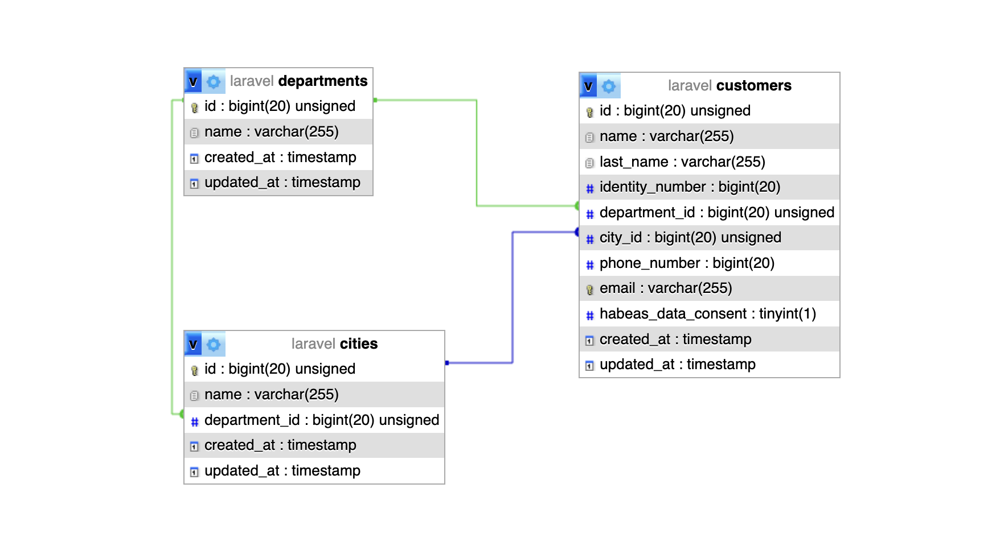
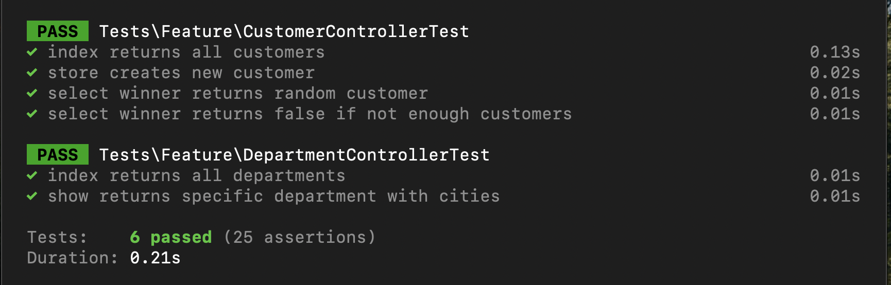

# Proyecto Fullstack: Angular y Laravel

Este proyecto es una aplicación fullstack que combina un frontend desarrollado en Angular y un backend construido con Laravel. Está diseñado para ser modular, escalable y fácil de mantener, siguiendo las mejores prácticas tanto en el desarrollo frontend como backend.

## Diagrama de la base de datos (se exclueron del gráfico las tablas que se instalan por defecto)



## Pruebas unitarias realizadas al backend



## Contenido del Proyecto

### Frontend (Angular)
- **Framework**: Angular 19+
- **Estructura**:
  - `src/app/models/`: Modelos de datos utilizados en la aplicación.
  - `src/app/interfaces/`: Interfaces para tipado fuerte en TypeScript.
  - `src/app/services/`: Servicios para la comunicación con el backend.
  - `src/app/pages/`: Componentes específicos de cada página.
  - `src/app/shared/`: Componentes reutilizables.
  - `src/environments/`: Configuración de entornos (desarrollo y producción).

### Backend (Laravel)
- **Framework**: Laravel 12+
- **Estructura**:
  - `app/Exports/`: Clases para exportar datos en formatos como Excel.
  - `app/Http/Controllers/`: Controladores para manejar las solicitudes HTTP.
  - `app/Models/`: Modelos Eloquent para interactuar con la base de datos.
  - `database/migrations/`: Migraciones para la estructura de la base de datos.
  - `database/seeders/`: Seeders para poblar datos iniciales.

## Cómo replicar el proyecto en un ambiente local

### Requisitos previos
- Node.js (v16 o superior)
- Composer
- PHP (v8.1 o superior)
- MySQL o SQLite
- Docker (opcional, para contenedores)

### Pasos

1. **Clonar el repositorio**:
   ```bash
   git clone <URL_DEL_REPOSITORIO>
   cd project
   ```

2. **Ejecutar Docker**:

   El archivo `docker-compose.yaml` se encuentra en la carpeta `/docker-rdbms`. Una vez ejecutado ya se contaría con **MariaDB** y **PhpMyAdmin** al cual se podría acceder desde el navegador mediante la dirección `http://localhost:8080` *(Usuario: root, Password: notSecureChangeMe)*

   ```bash
   docker-compose up -d
   ```

3. **Configurar el backend (Laravel)**:

   ```bash
   cd laravel
   composer install
   php artisan key:generate
   php artisan migrate --seed --force
   php artisan serve
   ```
   Esto iniciará el servidor en `http://localhost:8000`

4. **Configurar el frontend (Angular)**:

   ```bash
   cd ../angular
   npm install
   ng serve
   ```
   Esto iniciará el servidor en `http://localhost:4200`

## Buenas prácticas implementadas

### Backend (Laravel)
- **Estructura modular**: Uso de controladores, modelos y servicios para separar responsabilidades.
- **Exportación de datos**: Clases en `app/Exports/` para exportar datos en Excel.
- **Migraciones y seeders**: Migraciones para la estructura de la base de datos y seeders para datos iniciales.
- **Validación de datos**: Uso de `FormRequest` para validar las solicitudes.

### Frontend (Angular)
- **Componentes standalone**: Uso de componentes independientes para modularidad.
- **Servicios centralizados**: Servicios en `src/app/services/` para manejar la lógica de negocio y las llamadas HTTP.
- **Modelos e interfaces**: Uso de `src/app/models/` y `src/app/interfaces/` para tipado fuerte y consistencia.
- **Environments**: Configuración separada para desarrollo y producción en `src/environments/`.